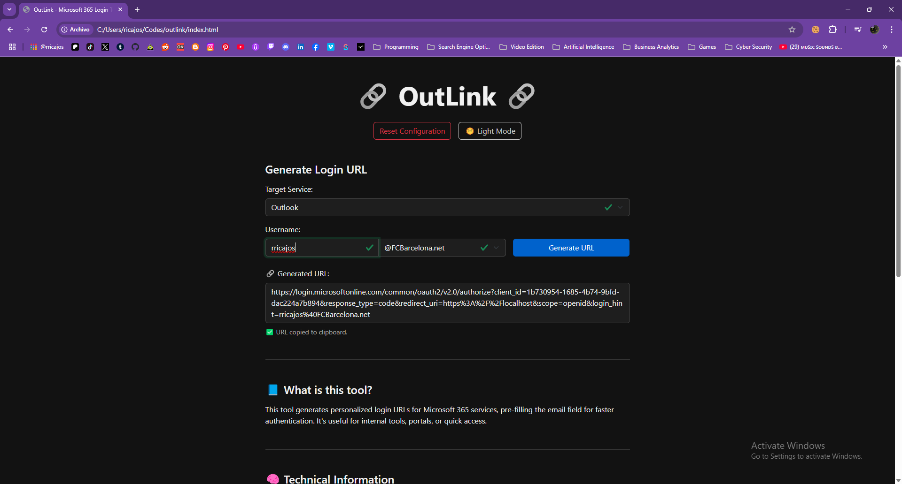

---

## 📄 `README.md`

```markdown
# 🔗 OutLink — Microsoft 365 Login URL Generator

**OutLink** is a lightweight web-based tool for generating Microsoft 365 login URLs with a pre-filled email address. Ideal for internal tools, login portals, or support workflows where users frequently need to log into Outlook, Teams, OneDrive, or SharePoint.

---

## 🚀 Features

- ✅ Generate login URLs for **Outlook, Teams, OneDrive, SharePoint**
- 🎯 Automatically fills the `login_hint` parameter (email)
- 📝 Manage and persist a list of custom domains (CRUD)
- 🌙 Supports **dark mode**
- 💾 Remembers your last-used email and settings
- 🔐 Runs 100% on the client — **no backend required**

---

## 🖼️ Screenshot

 <!-- Optional: Add your screenshot -->

---

## 🔧 How It Works

OutLink uses the Microsoft OAuth 2.0 endpoint or direct service URLs and adds the `login_hint` query parameter to pre-fill the email field.

Example URL (for Outlook):

```
https://login.microsoftonline.com/common/oauth2/v2.0/authorize?
client_id=1b730954-1685-4b74-9bfd-dac224a7b894
&response_type=code
&redirect_uri=https://localhost
&scope=openid
&login_hint=user@yourdomain.com
```

Other services (Teams, OneDrive, SharePoint) use similar logic with different base URLs.

---

## 🛠️ Getting Started

### 1. Clone this repository:

```bash
git clone https://github.com/rricajos/outlink.git
cd outlink
```

### 2. Open `index.html` in your browser

Or upload the project to **GitHub Pages** or any static host.

---

## 🧩 Structure

- `index.html` — Main HTML interface
- `outlink.js` — Logic: URL generation, domain CRUD, theme, persistence
- `style` — Dark/light theme inlined in HTML for simplicity
- `README.md` — This file

---

## 🌐 Hosting on GitHub Pages

> OutLink is a static HTML + JS app, perfect for GitHub Pages.

1. Push the project to your GitHub repository
2. Go to **Settings → Pages**
3. Select branch `main` (or `master`) and root folder `/`
4. Done! Share your GitHub Pages URL 🎉

---

## 🔐 Security & Privacy

This tool:
- Does **not** store any data on servers
- Works 100% in your browser (uses `localStorage`)
- Does not require authentication or access tokens

You are in full control of the generated URLs.

---

## ✨ Future Ideas

- 🔁 Export/import domain presets
- 🌐 Multilingual support (i18n)
- 🧪 Unit tests
- 🎨 Custom themes

---

## 📄 License

MIT License — free to use, modify, and share.

---

## 🙌 Credits

Built with 💻 using [Bootstrap](https://getbootstrap.com) and ☕ by [Your Name].

> If you like this tool, feel free to ⭐ star the repo!
